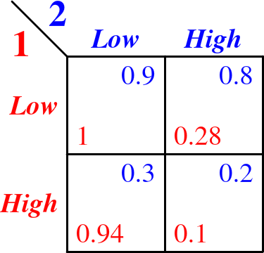
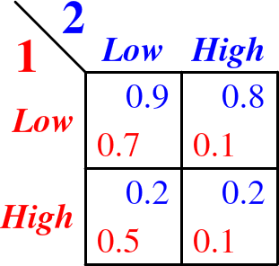

```{r setup, echo=FALSE, warning=FALSE, message=F}
library(knitr); library(zoo); library(xts);
library(caTools);
library(ggplot2)#; library(cowplot)
library(gridExtra)
library(dplyr); library(tidyr);
library(rjags); library(R2jags);
library(mcmcplots); library(superdiag)
opts_chunk$set(fig.align = 'center', fig.show = 'hold',
               fig.height = 4, warning = FALSE, message = FALSE,
               error = FALSE, echo=FALSE)
options(formatR.arrow = TRUE,width = 90, cache=TRUE, scipen=999)
source("functions.R") ## auxiliary functions 
```


# Single-species experiments

## Modelo

Usei o modelo de [@hostetler2015]. A ideia deste tipo de modelo
de contagem com detecção imperfeita é que os valores observados (no caso número de células)
é resultado de dois processos: a dinâmica do sistema (no caso representada por uma logística)
e os processos de amostragem que geram a contagem. A seguir descrevo cada um destes componentes do
modelo

### Nível da dinâmica do sistema

A cada passo de tempo o tamanho esperado da população é dado por uma logística a tempo discreto:

$$E[N_{t+1}] = N_t + (rN_t (1 - \frac{N_t}{K}))\Delta t$$

Onde $E[N_{t+1}]$ é o tamanho esperado (ou média) da população no tempo $t+1$, $N_t$ o tamanho no tempo anterior,
$r$ a taxa de crescimento intrínseco, $K$ a capacidade de suporte (me número de indivíduos) e $\Delta t$ o
tamanho do intervalo de tempo entre $t$ e $t+1$ em dias (que deve ser pequeno para este modelo
aproximar bem um processo contínuo.

Para representar fontes de variação estocástica na dinâmica populacional,
o tamanho da população no tempo $t+1$ segue uma distribuição Poisson, com
média $E[N_{t+1}]$. Isso equivale a dizer que a cada passo de tempo o valor efetivo da
população é sorteado de uma distribuição Poisson cuja média é o valor esperado pela
logística. 

### Nível da amostragem

A contagem de células é uma amostra do total, na qual ainda é possível detectar
apenas parte delas. Supondo que as regiões da placa que são inspecionadas são
uma amostra ao acaso da população (já que a cultura e homogeneizada antes das contagens),
o número de células na área amostrada segue uma distribuição
Poisson, cuja média é

$$E[n_t] = \frac{N_t}{A}{a}$$

Onde $n_t$ é o número de células na amostra, $A$ é a área total da cultura 
e $a$ a área amostrada. Este valor é apenas a densidade 
de células multiplicado pela área observada.

Deste total, uma proporção $p$ é detectada. Se estas detecções são eventos 
independentes o número de células observado em cada amostra segue
uma distribuição binomial, com probabilidade de sucesso (detectabilidade) $p$ e 
número de tentativas $n_t$. Sob esta premissa, cada célula na área amostrada
tem probabilidade $p$ de ser detectada e $1-p$ de não ser, e a média
de células detectadas é $p n_t$.

### Ajuste

Fiz um ajuste Bayesiano deste modelo para cada experimento, usando MCMC, 
implementado na linguagem [JAGS](http://www.uvm.edu/~bbeckage/Teaching/DataAnalysis/Manuals/manual.jags.pdf), com os pacotes 
[rjags](https://cran.r-project.org/package=rjags) e [R2jags](https://cran.r-project.org/package=R2jags), do R.
O código em jags do modelo está no arquivo [logistic2.jag](./cluster/logistic2.jag), no diretório *cluster*.

#### Priors

Usei distribuições a priori em geral pouco informativas, que foram:

* $r$ : lognormal com parâmetros $\mu=-2$, $\sigma=2$
* $K$ : uniforme entre $10$ e $100$ bilhões
* $p$: uniforme entre $0.9$ e $1$


Para definir as distribuições a priori das capacidade de suporte considerei o seguinte para definir um valor máximo:

* *Arcella* tem diâmetro de 57 micrômetros, o que dá uma área de `r round(pi*(57/2)^2,2)` micrômetros quadrados. 
Assim, um chute para densidade máxima é que em $1 cm^2$ haveria `r round(1e5/(pi*(57/2)^2),4)` mil indivíduos. 
A área do frasco de cultura
é `r 90*0.25` cm2, o que poderia ser completamente coberto por cerca 
de  `r round(100*90*.25/(pi*(57/2)^2),2)` milhões de células.
* *Pyxidicula* tem diâmetro de 5.3 micrômetros, o que dá uma área de `r round(pi*(5.3/2)^2,2)` $\mu^2$. 
Assim, um chute para densidade máxima é que em 1 $cm^2$ haveria `r round(1e2/(pi*(5.3/2)^2),2)` milhões de indivíduos. 
Assim a área do frasco de cultura poderia ser coberto por cerca 
de  `r round(100*90*.25/(pi*(5.3/2)^2),2)` milhões de células.


## Resultados

Os ajustes demoram e foram feitos no cluster. Os códigos e os arquivos binários do R com resultados
destes ajustes estão no diretório */home/paulo/lotka_volterra_tecamebas* do cluster Abacus 
(são muito grandes para ficar no GitHub). 
Os comandos abaixo carregam os binários com os resultados
dos ajustes. Para funcionar vc tem que copiar os arquivos RData que estão no Abacus 
para um diretório *cluster* em seu diretório de trabalho do R

```{r load model fits, eval=FALSE, echo=TRUE}
load("cluster/arc1.RData")
load("cluster/arc2.RData")
load("cluster/arc3.RData")
load("cluster/pyx1.RData")
load("cluster/pyx2.RData")
load("cluster/pyx3.RData")
load("cluster/compfit1.RData")
load("cluster/compfit2.RData")
load("cluster/compfit3.RData")
load("cluster/compfit4.RData")
load("cluster/compfit5.RData")
load("cluster/compfit6.RData")
load("cluster/compfit7.RData")
```

```{r load data single-species experiments}
## Tidy data table with all experiments
pyx.ind <- read.csv2("../dados_giulia/pyx_ind.csv") %>%
    gather(Pyx1A:Pyx3C, key=id, value=counts) %>%
    mutate(batch=as.factor(substr(id,4,4)))
arc.ind <- read.csv2("../dados_giulia/arc_ind.csv") %>%
    gather(Arcella1A:Arcella3C, key=id, value=counts) %>%
    mutate(batch=as.factor(substr(id,8,8)))
## Separate matrices for each experiment
pyx1 <- sel.ind(pyx.ind, 1)
pyx2 <- sel.ind(pyx.ind, 2)
pyx3 <- sel.ind(pyx.ind, 3)
arc1 <- sel.ind(arc.ind, 1)
arc2 <- sel.ind(arc.ind, 2)
arc3 <- sel.ind(arc.ind, 3)
```
### Observados e previstos

A figura abaixo mostra os números de células nas amostras
a cada tempo e o intervalo de Bayesiano a 95% de probabilidade.

Nos experimentos 1 e 2 o número de células de *Pyxidicula* 
dá um pulo entre seis e sete dias, e depois cai. Isso pode ser assinatura
de crescimento populacional muito rápido e/ou com *time delay*, que pode levar
a dinâmicas que oscilam ou mesmo caos. Como o modelo logístico
não tem estes componentes, não foi capaz de prever este comportamento.
O valor de $K$ estimado nestes casos está próximo do valor em que
a população parece estabilizar após 7 dias.  
Para *Arcella* o modelo logístico deu bons ajustes.

```{r single species obs x pred, fig.height=12}
pP1 <- p1(summary.df(fit.P1, data=pyx1)) + ggtitle("Pyx #1")
pP2 <- p1(summary.df(fit.P2, data=pyx2))+ ggtitle("Pyx #2")
pP3 <- p1(summary.df(fit.P3, data=pyx3))+ ggtitle("Pyx #3")
## Arcella
pA1 <- p1(summary.df(fit.A1, data=arc1)) + ggtitle("Arc #1")
pA2 <- p1(summary.df(fit.A2, data=arc2))+ ggtitle("Arc #2")
pA3 <- p1(summary.df(fit.A3, data=arc3))+ ggtitle("Arc #3")
grid.arrange(pP1,  pA1, pP2, pA2, pP3, pA3)
```

### Distribuições posteriores

Abaixo a distribuições posteriores dos parâmetros dos modelos. 
Os valores de $K$ estão em $cm^{-2}$.
O que me chamou a atenção:

* Quando deixo a priori da detecção entre zero e um o ajuste dá valores
irrealistas, de detectabilidade muito baixa. Fixando no intervalo mais
realista entre 0,9 e 1 temos posteriores com detecção próximo de um, em geral.
Acho que isto não é um grande problema, pois parece que neste caso as detecções são de fato altas.
* Para *Arcella* os três experimentos apontam para os mesmos valores de capacidade de
suporte (média das posteriores em 
`r round(mean(c(fit.A1$BUGSoutput$sims.list[["k"]], fit.A2$BUGSoutput$sims.list[["k"]],fit.A3$BUGSoutput$sims.list[["k"]])))`
células $cm^{-2}$, com pequena variação).
* Já para Pyxidicula cada experimento sustenta uma valor diferente de K, pois as
distribuições posteriores não sobrepõem e têm médias que vão de
`r round(mean(fit.P3$BUGSoutput$sims.list[["k"]]))` a 
`r round(mean(fit.P1$BUGSoutput$sims.list[["k"]]))` células $cm^{-2}$. 
* A taxa de crescimento intrínseco ($r$) estimada varia muito entre
experimentos e espécies, mas em todos os casos, com valores médios entre 
`r round(mean(fit.P3$BUGSoutput$sims.list[["r"]]),1)` e 
`r round(mean(fit.P2$BUGSoutput$sims.list[["r"]]),1)`. 
Por causa desta variação, não há uma tendência clara de que uma das espécies
tenha sempre maiores valores de $r$.
* Há mais incerteza nas estimativas dos valores de $r$ para *Arcella*,
sendo o caso extremo o experimento 1, em que o o intervalo
de credibilidade (95%) vai de
`r round(unname(quantile(fit.A1$BUGSoutput$sims.list[["r"]],0.025)),1)`
até 
`r round(unname(quantile(fit.A1$BUGSoutput$sims.list[["r"]],0.975)),1)`.


```{r logistic posteriors, fig.height=13.5}
lista.single <- list(
    Arc1=fit.A1$BUGSoutput$sims.list,
    Arc2=fit.A2$BUGSoutput$sims.list,
    Arc3=fit.A3$BUGSoutput$sims.list,
    Pyx1=fit.P1$BUGSoutput$sims.list,
    Pyx2=fit.P2$BUGSoutput$sims.list,
    Pyx3=fit.P3$BUGSoutput$sims.list)
par(mfrow=c(3,1), lwd=1.5)
post.plot(lista.single,par.name="p",  legend=FALSE, xlab="Parameter value")
post.plot(lista.single,par.name="k", legend=FALSE, xlab="Parameter value")
post.plot(lista.single,par.name="r", xlab="Parameter value")
par(mfrow=c(1,1))
```


# Experimentos de competição

## Modelo

O mesmo que para a logística, com a diferença que o tamanho esperado
de cada população é dado pela equação de Lotka-Volterra:

$$E[A_{t+1}] = A_t + (r_1A_t (1 - \frac{A_t+\alpha P_t}{K_1}))\Delta t$$

$$E[P_{t+1}] = P_t + (r_2P_t (1 - \frac{P_t+\beta P_t}{K_2}))\Delta t$$

Onde $A$ e $P$ são os tamanhos populacionais de *Arcella* e *Pyxidicula*,
 e $\alpha$ e $\beta$ os coeficientes de competição interespecífica.

## Ajuste
Da mesma maneira. O código do modelo em jags está no arquivo [competition.jag](./cluster/competition.jag),
no diretório *cluster*.

#### Priors

Para os parâmetros $r$ e $K$ tentei usar como priors as distribuições
posteriores dos ajustes logísticos, combinadas. A lognormal
foi um bom modelo para descrever as distribuições de $r$. E assim usei como priors
as lognormais ajustadas às distribuições dos valores posteriores de $r$ dos três
experimentos juntos.
Para os valores de $K$ tentei a mesma abordagem mas os valores de $K$ ajustados foram absurdamente
altos. Por isto optei por uma distribuição uniforme, que fixa um valor máximo. 
Usei uniformes no intervalo e 1000 a 35000, que 
parecia mais plausível pelas posteriores de $K$. 
Para os coeficientes de competição usei lognormais com média
correspondente á razão de tamanhos das duas espécies e variâncias muito
grandes, para torná-las pouco informativas.

```{r competicao leitura dados}
comp <- read.csv2("../dados_giulia/comp_counts_sintese_final.csv")
experim1 <- sel.exp(comp, batch = 1)
experim2 <- sel.exp(comp, batch = 2)
experim3 <- sel.exp(comp, batch = 3)
experim4 <- sel.exp(comp, batch = 4)
experim5 <- sel.exp(comp, batch = 5)
experim6 <- sel.exp(comp, batch = 6)
experim7 <- sel.exp(comp, batch = 7)
```


## Modelos


### Observado e previsto em cada experimento

* Os modelos fizeram ajustes razoáveis para todos os experimentos,
apesar de algumas previsões terem bastante incerteza. 
Ainda assim sempre é possível identificar as trajetórias
previstas das populações (isto é, os intervalos de credibilidade
não ocupam todo o gráfico, como tivemos em ajustes anteriores).

* Nestes experimentos os tamanhos populacionais são
consideravelmente menores do que nas culturas 
monoespecíficas. *Arcella* isolada chegou estabilizou em 150-200 células,
mas nestes experimentos nunca passou de 45 células. Os números 
para *Pyxidicula* (exceto os picos no dia 7) são 400-750 contra
um máximo de 125 células na presença de *Arcella*.

* Há muita variação de comportamentos entre experimentos,
como já discutimos. Os bons ajustes mostram que o modelo é capaz
de descrever bem a dinâmica, mas com diferentes valores de parâmetros
(a seguir)


```{r competition obs x predicted counts, fig.height=13.5}
## Graficos
pe1 <- p3(summary.df2(fit1, experim1)) + ggtitle("Experiment #1") +
    annotate("text", x = c(8,9.5), y = c(70,7.5),
             label = c("Pyxidicula","Arcella"),
             color=c("blue","red"), size = 4)
pe2 <- p3(summary.df2(fit2, experim2)) + ggtitle("Experiment #2")
pe3 <- p3(summary.df2(fit3, experim3)) + ggtitle("Experiment #3")
pe4 <- p3(summary.df2(fit4, experim4)) + ggtitle("Experiment #4")
pe5 <- p3(summary.df2(fit5, experim5)) + ggtitle("Experiment #5")
pe6 <- p3(summary.df2(fit6, experim6)) + ggtitle("Experiment #6")
pe7 <- p3(summary.df2(fit7, experim7)) + ggtitle("Experiment #7")
grid.arrange(pe1,pe2,pe3,pe4,pe5,pe6,pe7, ncol=2)
```

### Distribuições posteriores dos parâmetros

* Há enorme incerteza quanto aos valores de $k$ das duas espécies
neste experimento (note que a escala das posteriores está em log). 
Mesmo os limites inferiores dos intervalos de credibilidade
são da ordem de milhares, bem acima do que é observado no experimentos.
Uma explicação para isto é que dados não têm informação
sobre este parâmetro, porque as populações estão muito longe da
capacidade de suporte e/ou porque oscilam de maneiras que não são
compatíveis com os valores de $K$ observados nos experimentos monoespecíficos.
Em resumo, os dados não fornecem muita informação sobre $K$. Como os valores estimados
estão muito altos, podemos considerar que no experimento as espécies estão sob pouco efeito
da competição intra-específica.

* Por outro lado, os valores de $r$ para as duas espécies foram bem menores 
do que nas culturas monoespecíficas. Para *Arcella* as médias das posteriores
foram cerca de cinco vezes menores. Para *Pyxidicula* pelo menos metade, exceto
para o experimento 3, que teve média da mesma magnitude das monoculturas.

* As posteriores indicam que há muito mais variação entre experimentos
no valor de $r$ para *Pyxidicula*, comparado com *Arcella*. Assim, os experimentos
em que esta espécie teve crescimento mais acelerado tiveram posteriores deste parâmetro com
médias maiores (Experimentos 3, 4, e 1). Já para Arcella apenas os experimentos 3 e 4
tiveram valores de $r$ menores que os demais. Estes são experimentos em que
a população desta espécies parece se estabilizar em tamanhos bem abaixo dos
de *Pyxidicula*.

* Os coeficientes de competição foram estimados com margem razoável de
incerteza e são compatíveis com o tamanho relativo das espécies. 
Os coeficientes de *Arcella* sobre *Pyxidicula* é da ordem de unidades a uma dezena e
o coeficiente de *Pyxidicula* sobre *Arcella* é da ordem de décimos. 
A distribuições posteriores destes coeficientes de cada espécie são muito parecidas entre experimentos,
com exceção do experimento 3, em que o efeito de *Arcella* sobre *Pyxidicula* foi
consideravelmente maior que nos outros experimentos.

```{r competition posteriors, fig.height=12}
lista2 <- list(
    Exp1=fit1$BUGSoutput$sims.list,
    Exp2=fit2$BUGSoutput$sims.list,
    Exp3=fit3$BUGSoutput$sims.list,
    Exp4=fit4$BUGSoutput$sims.list,
    Exp5=fit5$BUGSoutput$sims.list,
    Exp6=fit6$BUGSoutput$sims.list,
    Exp7=fit7$BUGSoutput$sims.list)
par(mfrow=c(3,2), lwd=1.5)
post.plot(lista2,par.name="kA", transf=TRUE, legend=FALSE, xlab="Log(Parameter value)")
post.plot(lista2,par.name="kP", transf=TRUE, legend=FALSE, xlab="Log(Parameter value)")
post.plot(lista2,par.name="rA", legend=FALSE, xlab="Parameter value")
post.plot(lista2,par.name="rP", legend=FALSE, xlab="Parameter value")
post.plot(lista2,par.name="aAP", legend=FALSE, xlab="Parameter value")
post.plot(lista2,par.name="aPA")
par(mfrow=c(1,1))
```

# Uma hipótese de jogo evolutivo


```{r compet simul}
sim.comb <- sapply(expand.grid(paste("fit",1:7, sep=""),
                        paste("fit.A",1:3, sep=""),
                        paste("fit.P",1:3, sep="")),
                     as.character)

nrep <- round(5000/nrow(sim.comb))
sim.res.e <- matrix(NA, 2, nrep*nrow(sim.comb))
for(i in 1:nrow(sim.comb)){
    intervalo <- (i*nrep-(nrep-1)):(i*nrep)
    sim.res.e[,intervalo] <- do.call("sim.compet2",
                                    args=list(obj1=eval(parse(text=sim.comb[i,1])), obj2=eval(parse(text=sim.comb[i,2])),
                                              obj3=eval(parse(text=sim.comb[i,3])),
                                              data=experim1, nrep=nrep))$estocast[ncol(experim1[[1]]),,]
    }

## Repetindo para 60 dias
nrep <- round(5000/nrow(sim.comb))
sim.res <- matrix(NA, 2, nrep*nrow(sim.comb))
sim.res.a <- matrix(NA, nrep*nrow(sim.comb), 3)
dt <- rep(1/5, 300)
for(i in 1:nrow(sim.comb)){
    intervalo <- (i*nrep-(nrep-1)):(i*nrep)
    tmp <- do.call("sim.compet2",
                   args=list(obj1=eval(parse(text=sim.comb[i,1])), obj2=eval(parse(text=sim.comb[i,2])),
                             obj3=eval(parse(text=sim.comb[i,3])),
                             data=experim1, nrep=nrep, dt=dt))
    sim.res[,intervalo] <- tmp$estocast[length(dt),,]
    sim.res.a[intervalo, ] <- tmp$analitico
    }
```

Em reunião 19/03/2018 Pan propôs a hipótese de que quando juntas
as duas espécies teriam probabilidades altas de se extinguir se mantivessem
suas taxas de crescimento intrínseco originais (observadas nas culturas puras).
Assim, reduzir a reprodução seria uma adaptação para não correr este risco.

Uma previsão desta hipótese é que as extinções devem ser um resultado
frequente dos modelos de competição se usarmos nestes modelos os valores
de $r$ e $K$ observados nas culturas puras. Para testar isto, 
simulei estes modelos pelo mesmo tempo dos experimentos de competição,
tomando os parâmetros das distribuições *a posteriori* obtidas
com o ajuste Bayesiano da seguinte forma:

* Valores de $r$ e $K$ de cada espécie tomados das *posterioris* dos ajustes
aos dados dos experimentos de cultura pura. 
* Valores dos coeficientes de competição tomados das *posterioris* dos ajustes
aos dados dos experimentos de competição.

Os parâmetros de cada experimento foram tomados pareados (isto é, não sorteei
independentemente um valor de $r$ e de $K$ para uma espécie, e sim sorteei um 
par deste parâmetros da distribuição bivariada, para preservar sua eventual correlação).

Com três experimentos de cultura pura por espécie e sete experimentos de competição
é possível fazer `r nrow(sim.comb)` combinações de distribuições *a posteriori*. 
De cada uma destas combinações de Tomei `r nrep` amostras.

A proporção das simulações que tiveram populações extintas e não extintas
de cada espécie no tempo de um experimento foram:

```{r tabela extincoes}
t1 <- table(sim.res.e[1,]>0, sim.res[2,]>0)/(nrep*nrow(sim.comb))
colnames(t1) <- c("N(Pyx) = 0", "N(Pyx) > 0")
rownames(t1) <- c("N(Arc) = 0", "N(Arc) > 0")
kable(t1, digits=3,
      caption="Proporção de simulações do modelo de competição em a população de cada espécie chegou ao fim de 11.3 dias com tamanhos maiores que zero.")
```

O evento mais provável quando as duas espécies usam seus valores de $r$
originais é a persistência de *Pyxidicula* apenas, seguido
pela coexistência. A co-extinção e a persistência 
apenas de *Arcella* têm baixa probabilidade.

Mas quando prolongamos a simulação para 60 dias
a probabilidade de coexistência cai e a de persistência
de apenas uma das espécies aumenta, o que sugere que
a coexistência a longo prazo não é possível.

```{r tabela extincoes 60 dias}
t1m <- table(sim.res[1,]>0, sim.res[2,]>0)/(nrep*nrow(sim.comb))
colnames(t1m) <- c("N(Pyx) = 0", "N(Pyx) > 0")
rownames(t1m) <- c("N(Arc) = 0", "N(Arc) > 0")
kable(t1m, digits=3,
      caption="Proporção de simulações do modelo de competição em a população de cada espécie chegou ao fim de 60 dias com tamanhos maiores que zero.")
```

#### Modelos sem estocasticidade

Para avaliar se a estocasticidade altera o efeito,
também calculei os tamanho das populações no equilíbrio
segundo o modelo Lotka-Volterra sem estocasticidades.
Estes valores no equilíbrio são:

$$\hat A  =  \frac{K_1-\alpha K_2}{1-\alpha \beta}$$


$$\hat P  =  \frac{K_2-\beta K_1}{1-\alpha \beta}$$

E caso ambos sejam positivos o equilíbrio será estável se

$$\frac{1}{\beta} \ < \ \frac{K_1}{K_2} \ < \ \alpha$$


Então calculei estes valores de outras 5000 combinações de parâmetros sorteadas das posteriores
da mesma maneira. A proporção destas combinações que resultam em tamanho populacionais
no equilíbrio maior que zero e que cumprem a condição de estabilidade estimam as probabilidades
de persistência e extinção no equilíbrio, sob este modelo. 


```{r solucao analitica}
t1a <- table(sim.res.a[,1]>0, sim.res.a[,2]>0)/(nrep*nrow(sim.comb))
nce <- sum(sim.res.a[,1]>0 & sim.res.a[,2]>0 & !sim.res.a[,3])
t1a[1,1] <- t1a[1,1]-nce/(nrep*nrow(sim.comb))
t1a[1,2] <- t1a[1,2]+nce/(nrep*nrow(sim.comb)*2)
t1a[2,1] <- t1a[2,1]+nce/(nrep*nrow(sim.comb)*2)
colnames(t1a) <- c("N(Pyx) = 0", "N(Pyx) > 0")
rownames(t1a) <- c("N(Arc) = 0", "N(Arc) > 0")
kable(t1a, digits=3,
      caption="Proporção das combinações de parâmetros estimados em que  a população de cada espécie persiste, sob o modelo determinístico de competição.")
```

Estes valores indicam que a coexistência não
deveria ocorrer, ou é pouquíssimo provável, 
caso as duas espécies mantivessem os valores de
$K$ e $r$ observados nas culturas puras.


## Matriz de *payoffs*


Vamos supor que cada espécie tem a estratégia de manter $r$ alto ou baixo,
e que fazem isto em reação ao que a outra está fazendo.
Neste cenário simples podemos aplicar 
[teoria de jogos básica](https://en.wikipedia.org/wiki/Normal-form_game)
e montar as matrizes de *payoff* para cada espécie, que expressam
o ganho de cada estratégia possível, para cada espécie.

Para fazer isto, rodei as mesmas simulações de Lotka-Volterra, mas sorteando
os parâmetros das *posterioris* para corresponder a cada
uma das situações. Por exemplo, para
simular uma situação em que *Arcella* mantém o $r$ alto mas não *Pyxidicula*,
sorteei os valores de $r$ e $k$ das *posterioris* dos experimentos de cultura pura
de *Arcella*, mas os demais parâmetros das *posterioris* dos experimentos
de competição. Para simular a situação em que apenas *Pyxidicula* mantém o $r$
alto fiz o contrário. Antes de detalhar estes procedimentos vai uma
explicação de como analisei as matrizes de *payoff* obtidas assim.


```{r posterior payoffs, eval=FALSE}
## Codigo para rodar as matrizes de payoff a posteriori
## Um pouco lento, está paralelizado
source("postNash.R")
```

### Critérios de equilíbrio


As tabelas de *payoff* mostram o ganho para cada espécie
em cada combinação de estratégias. Este ganho pode ser por exemplo a probabilidade de persistência ou o 
tamanho da população após um certo tempo. A seguir um exemplo destas matrizes:



Nesta tabela os valores de payoff para *Arcella* (vermelho) na primeira linha são maiores que os valores
na segunda linha, em cada coluna. Isto quer dizer que para esta combinação de parâmetros 
a estratégia mais vantajosa para  *Arcella* é sempre a da primeira 
linha, ou seja, manter o $r$ baixo, independente da estratégia de *Pyxidicula*

Da mesma forma, os valores para *Pyxidicula* (azul) 
da primeira coluna de cada linha são os maiores. 
Ou seja, para qualquer estratégia de *Arcella*
a estratégia mais vantajosa  para *Pyxidicula* 
também é manter o $r$ baixo.

Neste caso temos um [Equilíbrio de Nash](https://en.wikipedia.org/wiki/Nash_equilibrium),
com as duas espécies em estratégia de manter baixos crescimentos populacionais.

#### Equilíbrio geral

Há condições de equilíbrio de estratégias menos estritas que as de Nash,
porque mesmo sem esta condição 
é possível que uma ou mais estratégias 
sejam estáveis. 
Por exemplo, para as matrizes a seguir há dois equilíbrios,
definidos como combinações de estratégias em que nenhuma das duas espécies
consegue aumentar seu *payoff* se mudar de estratégia, se a outra espécie
não mudar:



Os equilíbrios são ambas as espécies com baixo $r$ (Low/Low) ou
ambas com $r$ alto (High/High). Note que nestes dois casos a mudança
de estratégia leva a um benefício igual ou menor.


## Probabilidades de equilíbrio de cada estratégia

Nesta seção uso os critérios de equilíbrio definidos acima para 
analisar as matrizes de *payoff* obtidas com as simulações.

Chamo aqui "combinação de parâmetros" um conjunto de valores dos parâmetros
tomados das posteriores dos experimentos de competição, e tomados das posteriores
dos experimentos de culturas puras. Para cada combinação desta repeti a simulação 100 vezes e 
com isso montei duas matrizes de *payoffs*:

* Probabilidade de persistência: proporção das 100 réplicas de simulações com os mesmos parâmetros 
em que cada espécie tinha população maior que zero ao fim da simulação.
* Tamanho populacional médio: média dos tamanhos populacionais nas 100 réplicas ao fim de cada simulação.

Simulei 20 combinações de parâmetros para cada uma das `r nrow(sim.comb)`
combinações possíveis das 7 posteriores dos experimentos de competição com
as 3 posteriores de cada experimento de cultura pura. Ainda, testei simulações
que terminavam após o tempo que duraram os experimentos de competição 
( `r max(as.numeric(colnames(experim1[[1]])))` dias), 60 e 120 dias, a intervalos
de $1/3$ de dia[^1].

Em resumo, para cada combinação de parâmetros obtive então uma matriz de *payoffs*
de persistência e outra de tamanho populacional. Verifiquei em cada uma destas matrizes
quais eram as combinações em equilíbrio de Nash e em equilíbrio senso geral,
como defini acima. As proporções das matrizes em que cada estratégia cumpriu os requisitos de um 
destes equilíbrios estimam as probabilidades posteriores destes equilíbrios,
ou seja a probabilidade posterior de que cada combinação de estratégias seja estável.

Seguem as tabelas com estas probabilidades para os dois critérios
de equilíbrio e para as duas medidas de *payoff*

### Payoffs baseados na probabilidade de persistência


```{r prob strategies pop persist}
f1 <- function(x, i, j, k){
    apply(x[[i]][,j:k], 2, mean)
}
pers.nash <- matrix(
    c(apply(sapply(post.Nash.short, f1, i=2, j=1, k=12), 1, mean)[1:4],
      apply(sapply(post.Nash, f1, i=2, j=1, k=12), 1, mean)[1:4],
      apply(sapply(post.Nash.120, f1, i=2, j=1, k=12), 1, mean)[1:4]
      ),
    byrow=TRUE, ncol=4,
    dimnames=list(c("11.3 days", "60 days", "120 days"), c("LL", "LH", "HL", "HH"))
)

pers.eq <- matrix(
    c(apply(results3, 2, mean),
      apply(results, 2, mean),
      apply(results5, 2, mean)
      ),
    byrow=TRUE, ncol=4,
    dimnames=list(c("11.3 days", "60 days", "120 days"), c("LL", "LH", "HL", "HH"))
)
```

#### Equilíbrio de Nash

```{r persist Nash}
kable(pers.nash, digits=3, caption="Posterior probabilities of Nash equilibrium for each combination of strategies. Probabilities calculated from simulations of the competition dynamics upt ot 11.3, 60 and 120 days. Payoff: population persistence at the end of simulations.")
```

#### Equilíbrio em geral

```{r persist equilib}
kable(pers.eq, digits=3, caption="Posterior probabilities of equilibrium for each combination of strategies. Probabilities calculated from simulations of the competition dynamics upt ot 11.3, 60 and 120 days. Payoff: population persistence at the end of simulations.")
```

### Payoffs baseados no tamanho populacional médio

A seguir os mesmos cálculos, mas usando como *payoffs*
as abundâncias médias ao fim da simulação. Para comparar as duas espécies
estas abundâncias foram divididas pela capacidade de suporte de cada espécie.

```{r prob strategies pop size}
pops.nash <- matrix(
    c(apply(sapply(post.Nash.short, f1, i=1, j=1, k=12), 1, mean)[1:4],
      apply(sapply(post.Nash, f1, i=1, j=1, k=12), 1, mean)[1:4],
      apply(sapply(post.Nash.120, f1, i=1, j=1, k=12), 1, mean)[1:4]
      ),
    byrow=TRUE, ncol=4,
    dimnames=list(c("11.3 days", "60 days", "120 days"), c("LL", "LH", "HL", "HH"))
)

pops.eq <- matrix(
    c(apply(results4, 2, mean),
      apply(results2, 2, mean),
      apply(results6, 2, mean)
      ),
    byrow=TRUE, ncol=4,
    dimnames=list(c("11.3 days", "60 days", "120 days"), c("LL", "LH", "HL", "HH"))
)
```

#### Equilíbrio de Nash

```{r pop size Nash}
kable(pops.nash, digits=3, caption="Posterior probabilities of Nash equilibrium for each combination of strategies. Probabilities calculated from simulations of the competition dynamics upt ot 11.3, 60 and 120 days. Payoff: mean relative population sizes at the end of simulations.")
```

#### Equilíbrio em geral

```{r pop size equilib}
kable(pops.eq, digits=3, caption="Posterior probabilities of equilibrium for each combination of strategies. Probabilities calculated from simulations of the competition dynamics upt ot 11.3, 60 and 120 days. Payoff: mean relative population sizes at the end of simulations.")
```


# Pontos a discutir

* Grande redução das abundâncias quando as espécies são mantidas juntas. OK
* Muita variação nas dinâmicas competitivas.
* Segundo os modelos, os dois resultados acima explicam-se principalmente
pela queda nas taxas de crescimento, e também por sua variação entre experimentos.
Precisamos entender melhor este resultado, pois no modelo clássico Lotka-Volterra
o parâmetro $r$ seria uma característica intrínseca da espécie, enquanto o ambiente poderia
alterar mais facilmente $K$ e mesmo os coeficientes de competição.
* Análises baseadas em teoria de jogos com duas estratégias para cada espécie (baixar ou manter $r$) mostra
que as duas espécies baixarem o seus $r$ é uma combinação de estratégias
que pode ser estável, mas não sempre. Mais do que isto, outras combinações
têm maiores probabilidades.

# References


[^1]: No caso da simulação até o tempo dos experimento usei os intervalos reais de medição, que 
variaram entre `r min(diff(as.numeric(colnames(experim1[[1]]))))` e
`r max(diff(as.numeric(colnames(experim1[[1]]))))` dias.
